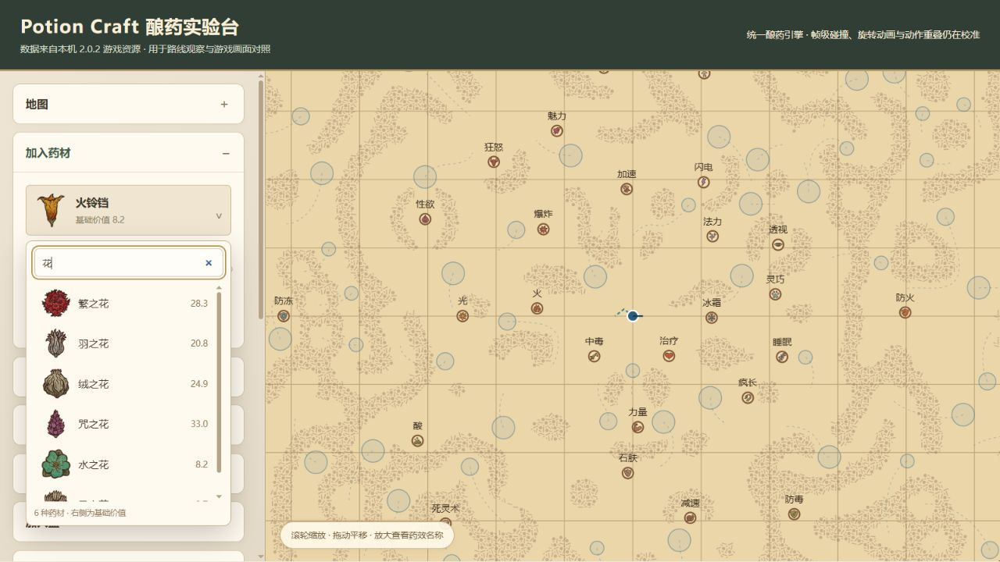

# Potion Craft Optimizer

Potion Craft 2.0.2 数据提取、酿药模拟、配方优化与花园生产优化项目。

## 文档入口

- [六类优化目标与实施计划](docs/PLAN.md)
- [酿药机制核对与校准进展](docs/BREWING_AUDIT.md)
- [实验台使用说明](playground/README.md)

当前远端先同步项目文档、界面预览与操作重放示例；引擎、界面源码和提取数据仍在本地项目中。下面的运行命令用于本地完整项目，仅下载当前远端文档不能启动实验台。

所有项目文件位于 `E:\VSCode\VSEnvironment\Potion_Craft_Project`。游戏安装文件按只读方式访问。用户已撤回启动或交互游戏本体的授权，后续仅通过代码、资源及外部资料核对机制。

| 目录 | 内容 |
|---|---|
| `docs/` | 六类优化目标的 [实施计划](docs/PLAN.md) 与 [机制核对记录](docs/BREWING_AUDIT.md) |
| `data/` | 本机 2.0.2 提取的药材、地图、碰撞体、盐和参数 |
| `reference/decompiled/` | 本机游戏脚本 DLL 的反编译结果 |
| `engine/` | GUI 与后续优化器共用的酿药引擎 |
| `playground/` | 浏览器实验台与本地服务 |
| `tools/` | 提取工具、数据校验及其依赖、反编译工具 |
| `tests/` | 操作组合与路径状态回归验证 |

在主目录运行 `python playground/serve.py`，打开 <http://127.0.0.1:8765/>。界面操作通过本地 API 调用 `engine/`，可部分搅拌、倒液、旋转、继续加药、收集药效和导出状态。运行 `python -m unittest discover -s tests -v` 验证操作组合，运行 `python tools/validate_data.py` 核对提取数据。

### 中文界面与原版图标

左侧各功能可独立折叠，浏览器会记住展开状态。药材选择器支持中文搜索、方向键和回车选择，每个选项显示原版药材图片与基础价值。58 种药材、41 种药效的名称取自本机游戏 `LocalizationData` 的 `zh` 列；地图药效圈显示原版对应图标，放大可查看中文名称。状态与操作记录也显示中文，导出文件继续保留稳定的内部标识供引擎重放。

显示资源清单在 `data/ui_manifest.json`，图片在 `playground/assets/`。使用原生 Python 3.13 运行 `tools/extract_ui_assets.py <Potion Craft_Data目录>` 可重新提取；该工具只读取游戏文件。药效图片按照游戏 `Icon.GetSprite` 的纹理、默认颜色、轮廓和划痕层合成。

当前仍处于计划 M0：普通路径操作、晶体三阶段传送、贤者之盐批次作用、力场修正、矩形越界失败、风箱/倒液冷却、漩涡螺旋移动与传送已接入。支持操作文件导入重放和漩涡观察场景。39 项回归检查通过，其中逐个核对了 99 个漩涡的落点与路径平移。Unity 帧时序、输入重叠与视觉旋转仍需精确校准，详见机制核对记录。
